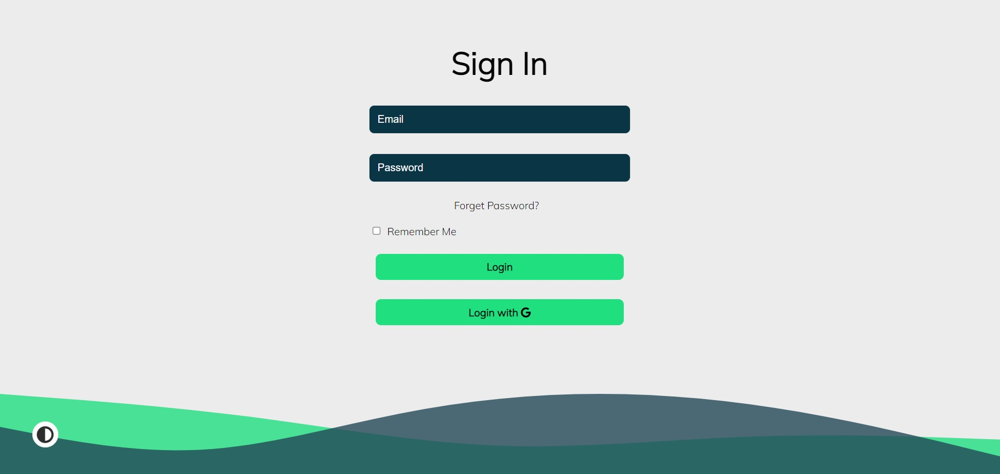
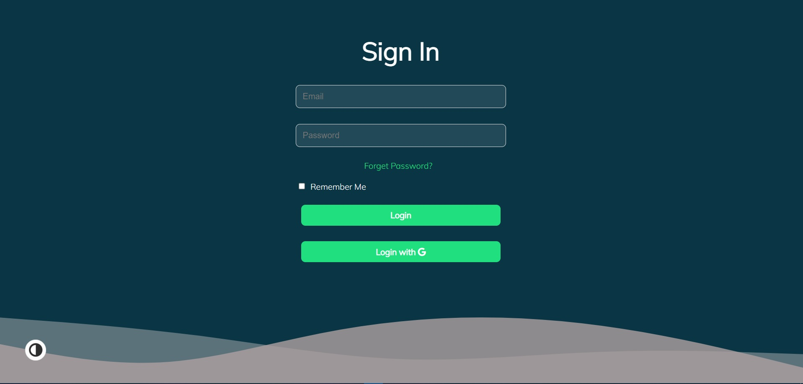
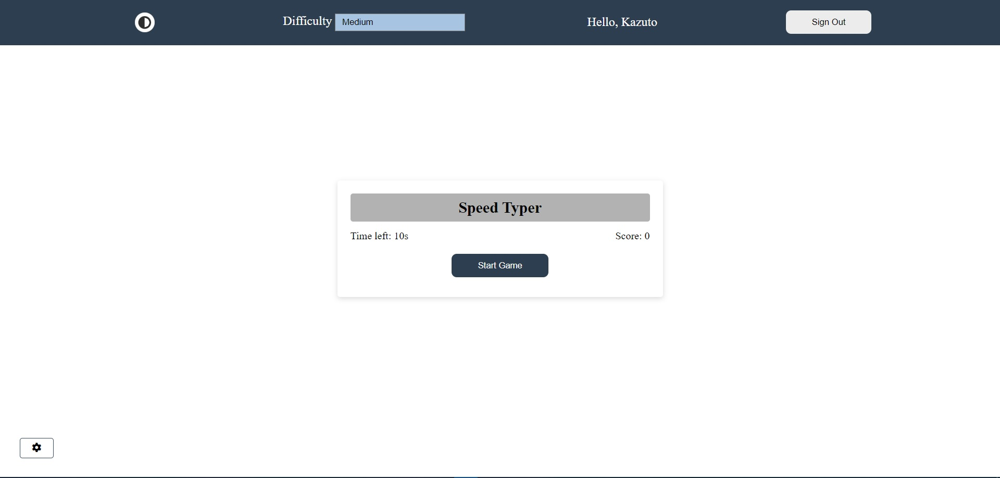
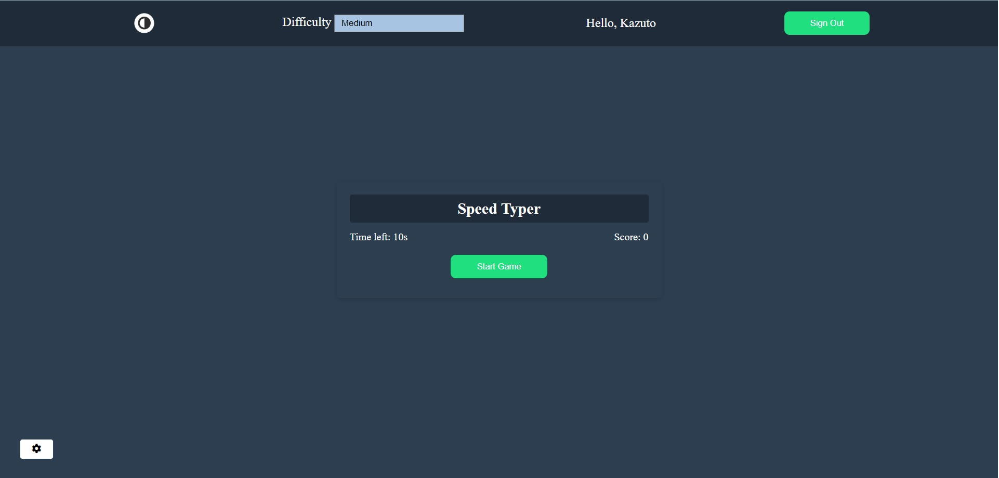
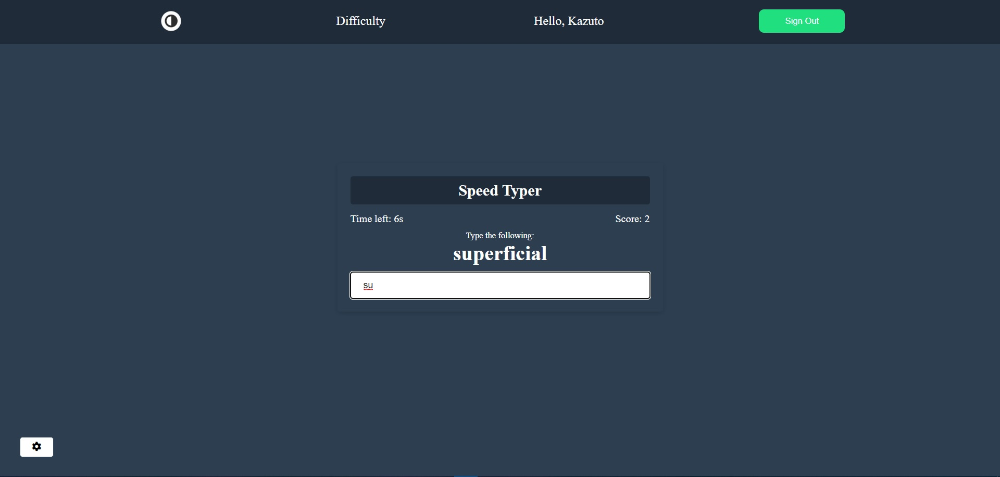

## Speed Typer Typing Game

The typing game which is build using HTML, SCSS, JAVASCRIPT. In this game, the user can enjoy themselves having a typing practise for various dictionary words.
The Game is build keeping in mind the limits of the user focus and attention.
The Highest Game score is set 100, so if the guest reaches 100 score, then the game will automatically terminate making the user game highest scorer.
The Game is supported using better UI colors, design and structure.

## PROJECT ACCOUNTS

The New User can login via Google, which is supported using FIREBASE Authentication, and can enjoy the game.
The User Credentials are safe with the game creator, and so he/she can fun and enjoy the game when playing with it.

## PROJECT HOSTED LINK

https://typing-game-a1.web.app/

## Project Specifications

- Create game UI including a difficuly setting
- Generate random word and place in DOM
- Start Typing Game whenever you want with just a button click
- Score increase after word is typed
- Time has been implemented so play within the constraints
- Add certain amount of time after word is typed based on difficulty
- Store difficulty setting in local storage
- Better UI with whole game theme switch enabled in it.

## FUTURE PLANS

I have been planning to use dictionary API, so the user can enjoy more random and frequently new words, and can have fun typing them.
Also there are several new features that one can think of like Error dedection when the user is typing, more advanced settings, which includes Word Capitalisation, Sentence Racing Game, and many more.
I plan on adding them all in the game so that the user can enjoy randomness of events in the game.

## IMAGES FOR THE GAME

## Thank you
